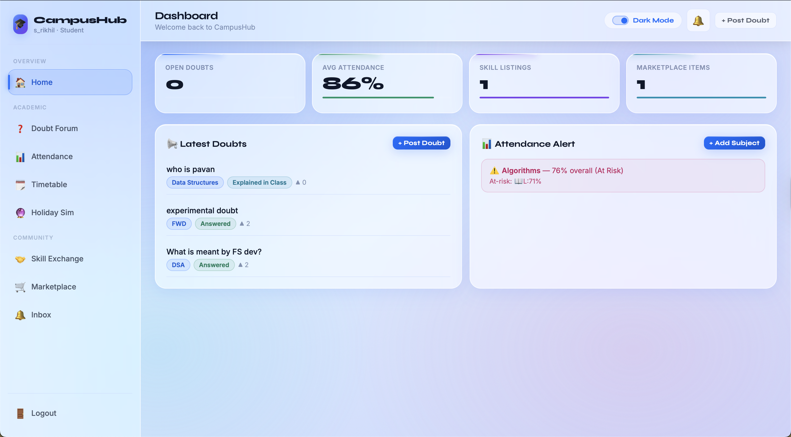

# CampusHub 🎓

> A student productivity dashboard — doubt forum, attendance tracker, marketplace, and more. All in one place.

---

## The Problem

College students juggle too many disconnected tools — WhatsApp for doubts, Excel for attendance, Instagram for buying/selling notes. There's no single platform built specifically for campus life.

CampusHub solves this by bringing everything a student needs into one clean dashboard.

---

## What it does

| Feature | Description |
|---|---|
| 🙋 Doubt Forum | Post academic doubts anonymously, upvote and get answers from peers |
| 📊 Attendance Tracker | Track subject-wise attendance with at-risk alerts |
| 📅 Timetable | View and manage your class schedule |
| 🛒 Marketplace | Buy and sell notes, books, and resources with other students |
| 🤝 Skill Exchange | List skills you can teach or learn from others on campus |
| 📬 Inbox | Notifications and updates in one place |
| 🌙 Dark Mode | Clean UI with light/dark toggle |

---

## Screenshots

### Dashboard


---

## Tech Stack

**Frontend (Web UI):**
- HTML5, CSS3, JavaScript
- Responsive dashboard layout

**Backend Logic (Java CLI version):**
- Java with custom Data Structure implementations
- Linked List — Doubt Forum (dynamic insertion and traversal)
- Stack — Notifications (LIFO — most recent first)
- Hash Table with Linear Probing — Marketplace (fast item lookup)
- Bubble Sort — Sort marketplace items by price
- Linear Search — Search marketplace by item title

---

## Why these Data Structures?

This wasn't arbitrary — each structure was chosen to match the real-world behaviour of the feature:

**Linked List for Doubts** — doubts keep getting added with no fixed limit. A linked list grows dynamically without wasting memory, perfect for an ever-growing forum.

**Stack for Notifications** — you always care about the most recent notification first. A stack's LIFO (Last In, First Out) behaviour mirrors exactly how notification trays work on your phone.

**Hash Table for Marketplace** — with potentially hundreds of listings, fast lookup is critical. Hash tables provide near-instant search regardless of how many items exist.

---

## Running the Java CLI version

```bash
# Compile
javac CampusHub.java

# Run
java CampusHub
```

### CLI Menu
```
--- CampusHub Menu ---
1. Post/View Doubts
2. View Market Sorted by Price
3. Search Market for an Item
4. Sell Item in Market
5. Check Recent Notification
6. Exit
```

---

## Opening the Web Dashboard

Simply open `campushub.html` in any browser — no server needed.

---

## What I learned

- Translating real student pain points into product features
- Implementing core Data Structures (Linked List, Stack, Hash Table) from scratch in Java
- Building a responsive multi-page dashboard UI with vanilla HTML/CSS/JS
- Thinking about user flows — how a student moves from seeing a doubt, to posting one, to checking attendance

---

## Roadmap

- [ ] Backend API with Node.js + Express
- [ ] Real-time doubt answering with WebSockets
- [ ] Login and authentication
- [ ] Mobile app version
- [ ] Deploy on Vercel/Netlify

---

*Built by [Rikhil Siripurapu](https://github.com/rikhil-33) — KL University, CSE AI/ML · Batch of 2029*
